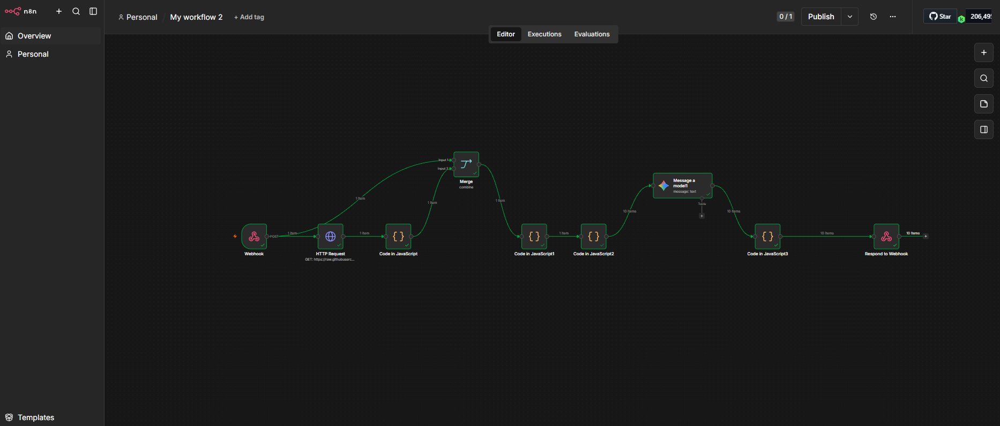

# Assistente de Investimentos com RPA + n8n

Projeto do laboratório da DIO que automatiza a recomendação de produtos de
investimento por e-mail. Um **RPA em Python** coleta os clientes de uma página
HTML e envia os dados para um **webhook no n8n**, que valida o saldo, escolhe o
produto adequado ao perfil de cada cliente, gera a mensagem com um **modelo de IA**
e devolve o resultado em JSON.

## Visão geral

```
Página HTML (clientes)
        │  requests + BeautifulSoup
        ▼
  RPA em Python  ──POST (JSON)──►  Webhook (n8n, exposto via ngrok)
                                         │
                                         ▼
                      HTTP Request (catálogo de produtos)
                                         │
                                         ▼
                  Code (JS) ── Merge ── Code (JS) ── Code (JS)
                                         │
                                         ▼
                              Modelo de IA (mensagem)
                                         │
                                         ▼
                      Code (JS) ──► Respond to Webhook (JSON)
```



## Como funciona

1. **Coleta (RPA):** o script `rpa/rpa_clientes.py` baixa a página, lê a tabela
   `#clientes` e monta uma lista com `nome`, `email`, `saldo` e `perfil`.
2. **Envio:** a lista é enviada em `POST` para o webhook do n8n no formato
   `{"clientes": [...]}`.
3. **Processamento no n8n:**
   - o fluxo busca o catálogo de produtos de investimento;
   - nós de Code em JavaScript tratam os dados, cruzam o **perfil**
     (Conservador, Moderado, Arrojado) e o **saldo** do cliente com o produto
     compatível e verificam o valor mínimo;
   - um modelo de IA redige a mensagem personalizada;
   - o último nó formata a saída e responde ao webhook.
4. **Resposta:** para cada cliente, o n8n devolve um JSON com destinatário,
   assunto, corpo do e-mail e metadados da recomendação. Exemplo:

```json
{
  "ok": true,
  "to": "ana@email.com",
  "subject": "...",
  "text_body": "...",
  "html_body": "...",
  "meta": {
    "nome": "Ana Silva",
    "perfil": "Conservador",
    "produto": "Tesouro Selic",
    "minimo": 500,
    "rentabilidade": "13.0%",
    "motivo": "saldo_ok"
  }
}
```

## Tecnologias

- Python 3 (`requests`, `beautifulsoup4`)
- n8n (Webhook, HTTP Request, Merge, Code/JavaScript, Respond to Webhook)
- Google Gemini (nó do n8n) para geração do e-mail
- ngrok (expor o n8n local para o RPA)
- HTML / GitHub Pages (fonte dos dados de clientes)

## Como executar

### 1. Importar o workflow no n8n
No n8n, crie um workflow novo, abra o menu `...` > **Import from file** e
selecione `n8n/workflow.json`. Configure a credencial do **Google Gemini** no nó
`Message a model1` e use **Execute workflow** para testes (ou ative o fluxo).

O nó `HTTP Request` lê o catálogo de produtos em `docs/data.csv` deste
repositório (via `raw.githubusercontent.com`, branch `main`). Formato do arquivo:
`perfil,produto,minimo,rentabilidade` (sem vírgulas dentro dos campos).

### 2. Expor o n8n com ngrok
```bash
ngrok http 5678
```
Copie a URL `https://....ngrok-free.dev` exibida em *Forwarding*.

### 3. Rodar o RPA
```bash
pip install -r requirements.txt

# Linux/macOS
export N8N_WEBHOOK="https://SEU-TUNEL.ngrok-free.dev/webhook-test/Clientes"
# Windows (CMD)
set N8N_WEBHOOK=https://SEU-TUNEL.ngrok-free.dev/webhook-test/Clientes

python rpa/rpa_clientes.py
```

> `webhook-test` só responde enquanto o n8n está escutando (botão
> *Execute workflow*). Com o fluxo ativado, use a URL de produção
> (`/webhook/Clientes`).

O script também roda no Google Colab: instale as dependências com
`!pip install requests beautifulsoup4` e defina `N8N_WEBHOOK` antes de executar.

## Estrutura do repositório

```
├── README.md
├── requirements.txt
├── rpa/
│   └── rpa_clientes.py
├── n8n/
│   └── workflow.json
└── docs/
    ├── data.csv          (catálogo de produtos por perfil)
    └── workflow.png
```

## Autor

João Paulo — [@makil2](https://github.com/makil2)
